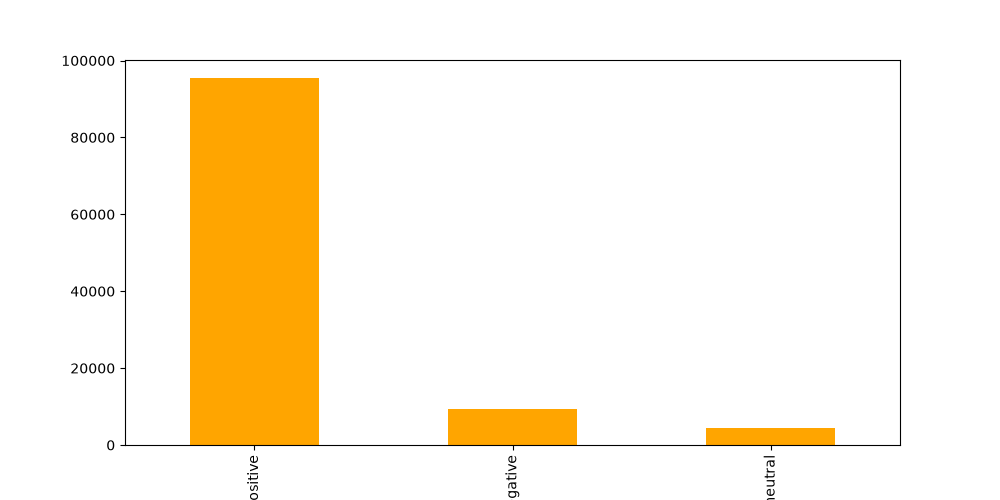
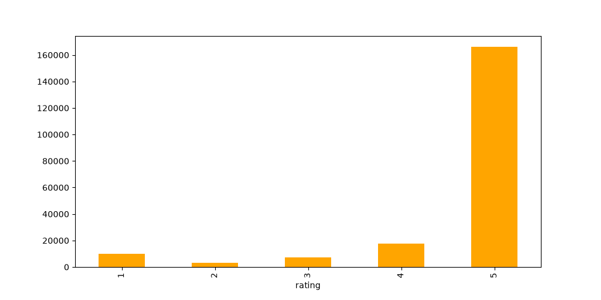
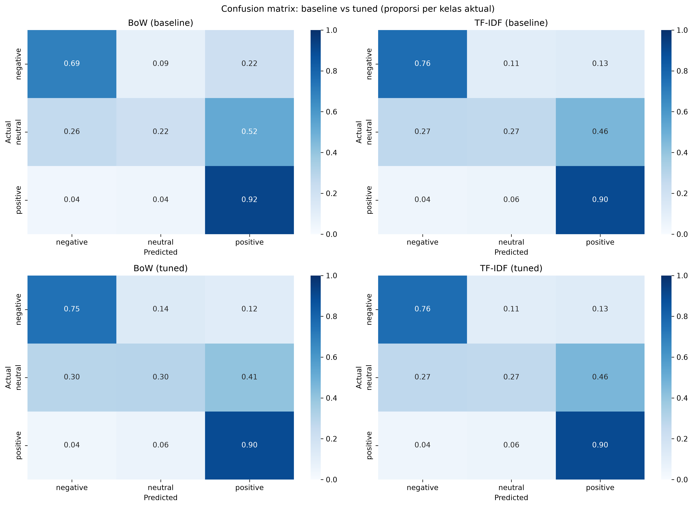
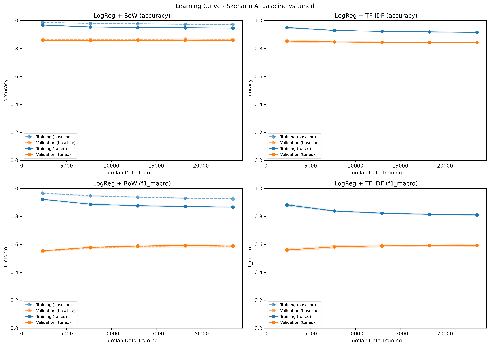
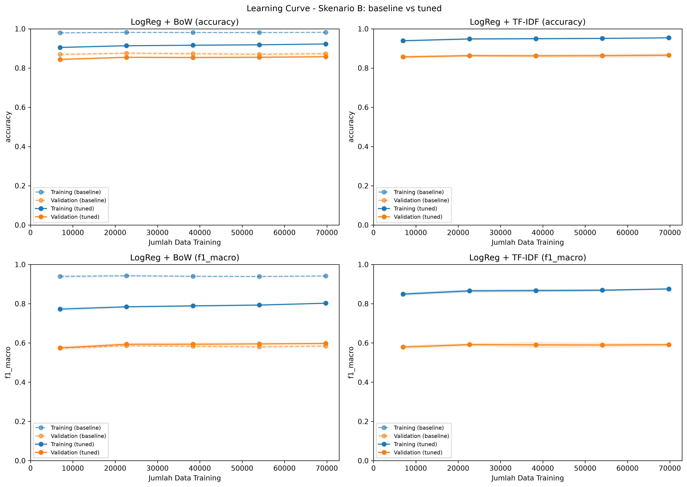
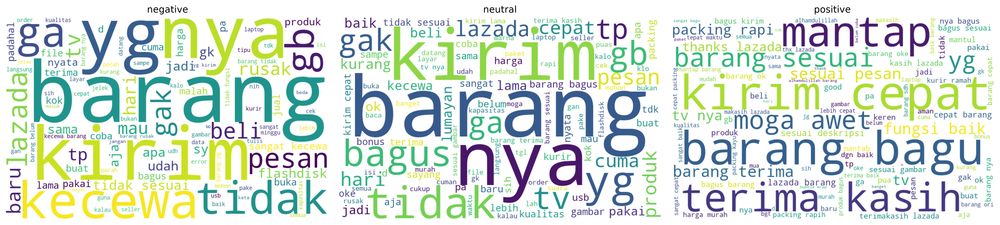
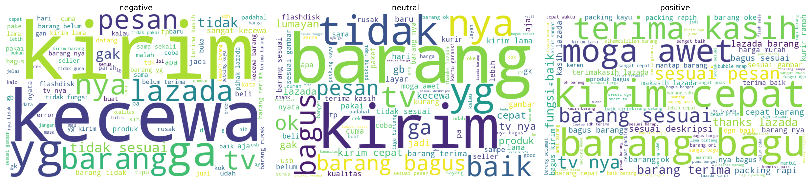

# Analisis Sentimen Ulasan Lazada: Perbandingan Dua Skenario Evaluasi

Klasifikasi sentimen tiga kelas (negative, neutral, positive) pada ulasan produk Lazada berbahasa Indonesia, menggunakan Bag of Words / TF-IDF dan Logistic Regression.

Proyek ini dibuat sebagai latihan data science. Fokusnya bukan mengejar skor setinggi mungkin, tetapi **melakukan evaluasi dengan benar**: mencegah *data leakage*, memilih parameter tanpa menyentuh test set, dan membaca hasil dengan jujur.

## Latar Belakang dan Studi Kasus

Platform e-commerce menerima ulasan pembeli dalam jumlah besar. Ulasan itu ditulis bebas: pendek, informal, bercampur bahasa Inggris, dan penuh singkatan. Membacanya satu per satu tidak praktis, padahal ulasan bernada negatif biasanya yang paling perlu segera ditindaklanjuti penjual atau tim layanan pelanggan. Klasifikasi sentimen otomatis adalah salah satu cara untuk menyaringnya.

Studi kasus proyek ini memakai **203.787 ulasan produk Lazada Indonesia** (file `20191002-reviews.csv`; tanggal pada nama file menunjukkan 2 Oktober 2019). Data diunduh dari [Lazada Indonesian Reviews (Kaggle, grikomsn)](https://www.kaggle.com/datasets/grikomsn/lazada-indonesian-reviews). Lisensi dataset tercantum pada halaman sumber tersebut, dan file data tidak disertakan di repo ini.

Tugasnya adalah mengklasifikasikan setiap ulasan ke tiga kelas: *negative*, *neutral*, dan *positive*. Data ini tidak sederhana, karena ada lima masalah yang memengaruhi cara model dibangun dan dievaluasi:

| Tantangan | Bukti pada data | Dampak |
|---|---|---|
| Label tidak berasal dari teks | Label dibuat dari rating (1 sampai 2, 3, 4 sampai 5) | Kelas neutral (rating 3) ambigu dan *noisy* |
| Kelas sangat timpang | positive 87,2%, negative 8,6%, neutral 4,2% | Akurasi menyesatkan, macro F1 lebih jujur |
| Duplikat dan label bertentangan | 72.077 baris duplikat (66%), 101 teks dengan label bertentangan | Risiko *data leakage* antara train dan test |
| Bahasa informal | Typo (`sesui`), campuran Inggris (`good`, `ok`), emoji | Preprocessing hanya menangani sebagian |
| Banyak ulasan tanpa teks | 94.432 dari 203.787 ulasan (46%) hanya berisi rating | Hasil belum tentu mewakili seluruh pembeli |

**Pertanyaan yang ingin dijawab**

1. Seberapa baik Logistic Regression dengan Bag of Words dan TF-IDF mengklasifikasikan tiga kelas sentimen?
2. Apakah cara menangani duplikat (dedup lalu split, atau group split) mengubah kesimpulan?
3. Apakah tuning parameter benar-benar memperbaiki generalisasi, atau hanya mengurangi overfit?
4. Kelas mana yang paling sulit diprediksi, dan apa penyebabnya?

**Skenario penggunaan yang dibayangkan** (bukan sistem produksi): model menandai ulasan yang kemungkinan negatif untuk ditinjau manusia, sehingga tim tidak perlu membaca seluruh ulasan.

## Tujuan Proyek

**Tujuan umum.** Membangun dan mengevaluasi pengklasifikasi sentimen tiga kelas untuk ulasan produk berbahasa Indonesia, dengan evaluasi yang bebas *data leakage* dan dilaporkan apa adanya, termasuk kelemahannya.

**Tujuan khusus**

1. Menyusun pipeline lengkap: cleaning, pelabelan dari rating, preprocessing teks (Sastrawi), vektorisasi, dan pemodelan.
2. Membandingkan Bag of Words dan TF-IDF dengan Logistic Regression pada data dan parameter vektorisasi yang sama.
3. Membandingkan dua cara menangani duplikat (skenario A dan B) untuk menguji apakah kesimpulan bergantung pada pilihan metodologi.
4. Menilai pengaruh tuning (GridSearchCV) dibanding baseline, baik pada skor maupun pada overfit.
5. Mengidentifikasi kelas yang paling sulit beserta penyebabnya.
6. Menyatakan keterbatasan penelitian secara eksplisit.

**Tujuan pembelajaran.** Memahami cara mencegah *data leakage*, memilih parameter tanpa menyentuh test set, dan memilih metrik yang tepat untuk data timpang.

**Di luar lingkup.** Model deep learning atau transformer, anotasi label secara manual, dan penerapan model ke sistem nyata.

**Tujuan dan bagian yang menjawabnya**

| Tujuan | Jawaban singkat | Bagian |
|---|---|---|
| 1 | Pipeline lengkap, tanpa kebocoran data | [3](#3-preprocessing), [4](#4-mengapa-ada-dua-notebook-a-dan-b) |
| 2 | Tidak ada pemenang jelas pada model tuned | [9](#9-perbandingan-a-dan-b), [10](#10-insight) |
| 3 | Tidak mengubah kesimpulan: macro F1 model yang sama berbeda sekitar 0,005 atau kurang antar skenario | [9](#9-perbandingan-a-dan-b) |
| 4 | Menurunkan overfit BoW, tetapi tidak menaikkan skor validasi secara berarti | [6](#6-mengapa-ada-baseline-dan-tuned-gridsearchcv-dan-cross-validation), [10](#10-insight) |
| 5 | Neutral: recall 0,21 sampai 0,32, precision 0,16 sampai 0,17 | [10](#10-insight) |
| 6 | Dirangkum di bagian keterbatasan | [11](#11-keterbatasan) |

## Ringkasan

- Ada **dua notebook** dengan cara pembagian data berbeda, keduanya bebas data leakage:
  - **Skenario A**: buang duplikat dulu, baru bagi train/test.
  - **Skenario B**: pertahankan duplikat, bagi train/test dengan *group split*.
- Setiap notebook membandingkan **baseline** (parameter default) dengan **tuned** (parameter dicari lewat GridSearchCV).
- **Macro F1 berada di kisaran 0,59 sampai 0,60** pada semua skenario dan model. Perbedaan antar model tuned lebih kecil daripada simpangan baku cross-validation.
- **Kelas neutral adalah hambatan utama**: recall hanya 0,21 sampai 0,32 dan precision sekitar 0,16 sampai 0,17.
- Tuning **menurunkan overfit** (terutama BoW) tetapi **tidak menaikkan skor validasi**. Menambah data juga tidak membantu karena kurva validasi sudah mendatar. Batasnya ada pada label, bukan pada model.

## Daftar Isi

Pengantar: [Latar Belakang dan Studi Kasus](#latar-belakang-dan-studi-kasus) · [Tujuan Proyek](#tujuan-proyek)

1. [Dataset dan label](#1-dataset-dan-label)
2. [Struktur repo](#2-struktur-repo)
3. [Preprocessing](#3-preprocessing)
4. [Mengapa ada dua notebook (A dan B)](#4-mengapa-ada-dua-notebook-a-dan-b)
5. [Model dan alasan pemilihan metrik](#5-model-dan-alasan-pemilihan-metrik)
6. [Mengapa ada baseline dan tuned, GridSearchCV, dan cross-validation](#6-mengapa-ada-baseline-dan-tuned-gridsearchcv-dan-cross-validation)
7. [Hasil skenario A](#7-hasil-skenario-a-dedup-lalu-split)
8. [Hasil skenario B](#8-hasil-skenario-b-group-split)
9. [Perbandingan A dan B](#9-perbandingan-a-dan-b)
10. [Insight](#10-insight)
11. [Keterbatasan](#11-keterbatasan)
12. [Langkah lanjutan](#12-langkah-lanjutan)
13. [Cara menjalankan](#13-cara-menjalankan)
14. [Catatan proses](#14-catatan-proses)
15. [Glosarium singkat](#15-glosarium-singkat)

---

## 1. Dataset dan label

Dataset: ulasan produk Lazada Indonesia (`data/20191002-reviews.csv`), **203.787 baris**. Sumber dan lisensinya dijelaskan di bagian [Latar Belakang dan Studi Kasus](#latar-belakang-dan-studi-kasus).

Label dibuat otomatis dari rating:

| Rating | Label |
|---|---|
| 1 sampai 2 | negative |
| 3 | neutral |
| 4 sampai 5 | positive |

Setelah cleaning tersisa **108.999 ulasan**, dengan distribusi yang sangat timpang:

| Kelas | Jumlah | Persentase |
|---|---|---|
| positive | 95.046 | 87,2% |
| negative | 9.422 | 8,6% |
| neutral | 4.531 | 4,2% |



Dua hal yang perlu diingat sejak awal:

- **Label berasal dari rating, bukan dari isi teks.** Ulasan berating 3 sering berisi campuran pujian dan keluhan, sehingga label neutral *noisy*.
- **Data sangat timpang.** Menebak "positive" untuk semua ulasan sudah menghasilkan akurasi sekitar 86 sampai 87%.

## 2. Struktur repo

```
sentimen-lazada/
├── README.md
├── requirements.txt
├── .gitignore
├── data/
│   ├── 20191002-reviews.csv          # data mentah (tidak disertakan di repo)
│   └── lazada_processed.csv          # hasil preprocessing, dibuat oleh notebook B (tidak disertakan di repo)
├── skenario_A_dedup_split.ipynb      # dedup lalu split
├── skenario_B_group_split.ipynb      # group split tanpa dedup
└── images/                           # gambar yang disimpan notebook
```

## 3. Preprocessing

Kedua notebook memakai preprocessing yang sama.

| Tahap | Keterangan | Jumlah data |
|---|---|---|
| Data mentah | | 203.787 |
| Gabung `reviewTitle` dan `reviewContent` | Buang ulasan tanpa teks (hanya rating) | 109.355 (94.432 dibuang, sekitar 46%) |
| Cleaning teks | Lowercase, hapus URL/HTML/angka/simbol, **kecilkan huruf berulang** (`mantaaapppp` menjadi `mantap`), rapikan spasi | |
| Stopword removal | Daftar stopword Sastrawi **setelah** kata negasi (`tidak`, `tak`, `bukan`, `belum`, `nggak`, `tanpa`) dan `ok` dikeluarkan (tersisa 118 kata), karena kata-kata itu membawa makna sentimen | |
| Stemming | Sastrawi, hanya pada **37.144 teks unik** supaya cepat, hasilnya dipetakan kembali ke semua baris | |
| Buang teks kosong setelah preprocessing | Misalnya ulasan yang hanya berisi emoji | 108.999 (356 dibuang) |

Temuan saat mengecek duplikat:

- **72.077 baris duplikat (66%)** berdasarkan teks hasil preprocessing.
- **101 teks punya label bertentangan** (teks sama, rating berbeda).
- Teks yang paling sering muncul: `mantap` (1.282 kali), `bagus` (1.165), `good` (721), `ok` (545), `mantul` (375), `barang bagus` (374).



## 4. Mengapa ada dua notebook (A dan B)

Temuan duplikat di atas memunculkan pertanyaan: **apa yang harus dilakukan dengan duplikat?**

Jika data dibagi secara acak biasa, teks yang sama persis bisa masuk ke train dan test. Model hanya perlu menghafal, sehingga skor test terlalu bagus. Itu disebut **data leakage**. Ada dua cara yang sah untuk mencegahnya, dan masing-masing menjawab pertanyaan yang berbeda:

| | **Skenario A: dedup lalu split** | **Skenario B: group split tanpa dedup** |
|---|---|---|
| Cara kerja | Buang semua duplikat dan teks berlabel bertentangan, lalu `train_test_split` biasa | Semua baris dengan teks sama dijadikan satu grup, satu grup masuk seluruhnya ke train atau ke test (`StratifiedGroupKFold`) |
| Data yang dipakai | 36.821 teks unik | 108.999 baris (duplikat dipertahankan) |
| Train / test | 29.456 / 7.365 | 87.200 / 21.799 |
| Duplikat di train | 0 | 57.661 (disengaja) |
| Teks bocor train-test | 0 | 0 |
| Test set berisi | Teks beragam (lebih sulit) | Distribusi asli, termasuk ulasan pendek yang berulang |
| Menjawab pertanyaan | "Seberapa baik model pada teks yang beragam?" | "Seberapa baik model di kondisi nyata, di mana ulasan seperti 'bagus' sering muncul?" |
| Kelemahan | Distribusi bergeser dari kenyataan, data berkurang 66% | Skor dipengaruhi ulasan pendek yang mudah ditebak |

Mengapa **keduanya** dibuat, bukan salah satu:

1. **Tidak ada satu cara yang benar secara mutlak.** Yang salah hanyalah split acak tanpa memperhatikan duplikat. Pilihan sisanya bergantung pada tujuan evaluasi.
2. **Duplikat di data ini adalah opini yang sah.** "Bagus" yang ditulis ribuan pembeli berbeda bukan spam, sehingga membuangnya membuat evaluasi kurang realistis (alasan adanya B). Sebaliknya, A memberi tolok ukur yang konservatif.
3. **Memastikan kesimpulan tidak bergantung pada pilihan metodologi.** Jika kedua skenario memberi kesimpulan yang sama, kesimpulan itu lebih bisa dipercaya (lihat [bagian 9](#9-perbandingan-a-dan-b)).
4. **Di B, test dilaporkan dua kali**: test penuh (realistis) dan test unik (kasus sulit). Test unik B inilah yang sebanding langsung dengan test A.

Pengaman yang dipasang di kedua notebook: sel `assert` setelah split yang menghentikan notebook jika ada teks bocor (di A juga jika ada duplikat di train), dan **vectorizer selalu berada di dalam `Pipeline`** sehingga di-fit ulang tiap fold dan tidak pernah melihat data validasi atau test.

## 5. Model dan alasan pemilihan metrik

**Fitur dan model**

- Dua representasi teks: **Bag of Words** (jumlah kata) dan **TF-IDF** (bobot kata), keduanya unigram + bigram dengan `max_features=50000`.
- Satu model: **Logistic Regression**. Dipilih karena cepat, mudah diinterpretasi, dan menjadi baseline yang kuat untuk teks.
- **`class_weight='balanced'`**: kelas neutral hanya 4,2% data. Pada percobaan awal (tidak disertakan di notebook), tanpa class weight model hampir tidak pernah menebak neutral.

**Mengapa macro F1, bukan akurasi**

Akurasi menyesatkan pada data timpang. Menebak "positive" untuk semua ulasan sudah menghasilkan akurasi **86,0% (test A)** dan **87,2% (test B)**, dan akurasi model di notebook ini justru berada di sekitar angka itu (0,845 sampai 0,871). **Macro F1** memberi bobot yang sama pada tiap kelas, sehingga kegagalan di neutral dan negative langsung terlihat. Selain itu dilaporkan recall per kelas, terutama neutral.

## 6. Mengapa ada baseline dan tuned, GridSearchCV, dan cross-validation

### Baseline vs tuned

Tiap notebook melatih model dua kali:

- **Baseline**: pengaturan default yang masuk akal (`C=1`, `min_df=2`, `ngram_range=(1, 2)`).
- **Tuned**: parameter terbaik hasil GridSearchCV.

Gunanya membuktikan bahwa tuning memang memberi perubahan, bukan sekadar menambah langkah. Tanpa baseline, tidak ada pembanding untuk menilai "lebih baik dari apa".

### Mengapa GridSearchCV

Parameter (`C`, `min_df`, `ngram_range`) harus dipilih, dan **tidak boleh dipilih dengan melihat test set**, karena test set lalu ikut "belajar" dari pilihanmu dan skornya menjadi terlalu optimis. GridSearchCV mencoba semua kombinasi pada **data training saja** dan memilih yang terbaik.

| Pengaturan grid | Nilai |
|---|---|
| `vec__ngram_range` | (1, 1), (1, 2) |
| `vec__min_df` | 2, 5 |
| `clf__C` | 0,03; 0,1; 0,3; 1 |
| Jumlah kombinasi | 16 per vectorizer (48 pelatihan dengan 3 fold) |
| Metrik pemilihan | `f1_macro` |

`C` yang kecil berarti regularisasi lebih kuat, yaitu cara utama mengurangi overfit pada model linear. Setelah memilih, GridSearchCV melatih ulang model terbaik pada seluruh data training (`refit=True`), sehingga model tuned langsung siap dipakai.

Parameter terbaik yang ditemukan:

| | A | B |
|---|---|---|
| BoW | `C=0,3`, `min_df=2`, `ngram (1,2)`, macro F1 CV 0,5931 | `C=0,03`, `min_df=2`, `ngram (1,2)`, macro F1 CV 0,5900 |
| TF-IDF | `C=1`, `min_df=2`, `ngram (1,2)`, macro F1 CV 0,5927 | `C=1`, `min_df=2`, `ngram (1,2)`, macro F1 CV 0,5856 |

TF-IDF memilih `C=1`, **sama dengan baseline**, sehingga hasil TF-IDF baseline dan tuned identik di semua tabel. Itu hasil yang sah, bukan error. Catatan: `C=1` ada di ujung atas grid, dan BoW di B memilih `C=0,03` yang ada di ujung bawah grid, sehingga nilai di luar grid belum diuji (lihat [Langkah lanjutan](#12-langkah-lanjutan)).

### Mengapa cross-validation

Cross-validation (CV) membagi data training menjadi beberapa fold, melatih di sebagian dan menilai di sisanya secara bergiliran. Seluruhnya terjadi di dalam data training, sehingga test set tetap utuh. Di proyek ini CV dipakai untuk tiga hal berbeda:

| Di mana | Fungsinya |
|---|---|
| **GridSearchCV** (3 fold) | Memilih parameter tanpa menyentuh test set |
| **Section 15** (5 fold, `return_train_score=True`) | Mengukur **kestabilan** (simpangan baku antar fold) dan **overfit** (selisih skor train dan validasi) |
| **Learning curve** | Melihat pengaruh jumlah data: tiap titik kurva adalah hasil CV pada ukuran data training tertentu |

Di skenario B, CV memakai `StratifiedGroupKFold` dengan `groups` sehingga satu teks tidak mungkin berada di fold training dan validasi sekaligus. Tanpa itu, leakage terjadi di dalam CV sendiri.

## 7. Hasil skenario A (dedup lalu split)

Test set: 7.365 teks unik (positive 6.337, negative 704, neutral 324).

| Model | Accuracy | Macro F1 | Recall negative | Recall neutral | Recall positive |
|---|---|---|---|---|---|
| BoW (baseline) | 0,8683 | 0,5937 | 0,7486 | 0,2130 | 0,9151 |
| TF-IDF (baseline) | 0,8452 | 0,5988 | 0,8068 | 0,3210 | 0,8763 |
| BoW (tuned) | 0,8593 | 0,5947 | 0,7812 | 0,2438 | 0,8995 |
| TF-IDF (tuned) | 0,8452 | 0,5988 | 0,8068 | 0,3210 | 0,8763 |

Overfit (macro F1, cross-validation 5 fold pada data training):

| Model | Train | Validasi | Selisih | SD validasi |
|---|---|---|---|---|
| BoW (tuned) | 0,8663 | 0,5886 | 0,2777 | 0,0082 |
| TF-IDF (tuned) | 0,8110 | 0,5938 | 0,2172 | 0,0099 |

Learning curve, titik data terbanyak (macro F1):

| Model | Versi | Train | Validasi | Selisih |
|---|---|---|---|---|
| BoW | baseline | 0,9257 | 0,5860 | 0,3398 |
| BoW | tuned | 0,8663 | 0,5884 | 0,2780 |
| TF-IDF | baseline = tuned | 0,8104 | 0,5937 | 0,2166 |





## 8. Hasil skenario B (group split)

Test set penuh: 21.799 baris (positive 19.009, negative 1.884, neutral 906). Test unik: 7.383 baris.

**Test penuh (realistis)**

| Model | Accuracy | Macro F1 | Recall negative | Recall neutral | Recall positive |
|---|---|---|---|---|---|
| BoW (baseline) | 0,8709 | 0,5858 | 0,6927 | 0,2185 | 0,9196 |
| TF-IDF (baseline) | 0,8610 | 0,5937 | 0,7638 | 0,2660 | 0,8990 |
| BoW (tuned) | 0,8578 | 0,5934 | 0,7479 | 0,2969 | 0,8954 |
| TF-IDF (tuned) | 0,8610 | 0,5937 | 0,7638 | 0,2660 | 0,8990 |

**Test unik (kasus sulit, sebanding dengan A)**

| Model | Accuracy | Macro F1 | Recall negative | Recall neutral | Recall positive |
|---|---|---|---|---|---|
| BoW (baseline) | 0,8598 | 0,5860 | 0,7058 | 0,2178 | 0,9099 |
| TF-IDF (baseline) | 0,8528 | 0,5975 | 0,7737 | 0,2699 | 0,8915 |
| BoW (tuned) | 0,8471 | 0,5954 | 0,7610 | 0,3006 | 0,8847 |
| TF-IDF (tuned) | 0,8528 | 0,5975 | 0,7737 | 0,2699 | 0,8915 |

Overfit (macro F1, cross-validation 5 fold dengan grup, data training):

| Model | Train | Validasi | Selisih | SD validasi |
|---|---|---|---|---|
| BoW (tuned) | 0,8025 | 0,5975 | 0,2050 | 0,0048 |
| TF-IDF (tuned) | 0,8754 | 0,5907 | 0,2848 | 0,0076 |

Learning curve, titik data terbanyak (macro F1):

| Model | Versi | Train | Validasi | Selisih |
|---|---|---|---|---|
| BoW | baseline | 0,9414 | 0,5843 | 0,3570 |
| BoW | tuned | 0,8025 | 0,5975 | 0,2050 |
| TF-IDF | baseline = tuned | 0,8753 | 0,5909 | 0,2844 |




## 9. Perbandingan A dan B

Perbandingan yang adil harus memakai test yang sepadan: **test A (unik)** dibandingkan dengan **test unik B**. Test penuh B ditampilkan sebagai pelengkap.

**Model tuned, skor test**

| Metrik | Model | A (test unik, n=7.365) | B (test penuh, n=21.799) | B (test unik, n=7.383) |
|---|---|---|---|---|
| Macro F1 | BoW | 0,5947 | 0,5934 | 0,5954 |
| Macro F1 | TF-IDF | 0,5988 | 0,5937 | 0,5975 |
| Accuracy | BoW | 0,8593 | 0,8578 | 0,8471 |
| Accuracy | TF-IDF | 0,8452 | 0,8610 | 0,8528 |
| Recall neutral | BoW | 0,2438 | 0,2969 | 0,3006 |
| Recall neutral | TF-IDF | 0,3210 | 0,2660 | 0,2699 |
| Recall negative | BoW | 0,7812 | 0,7479 | 0,7610 |
| Recall negative | TF-IDF | 0,8068 | 0,7638 | 0,7737 |

**Validasi dan overfit**

| | A | B |
|---|---|---|
| Macro F1 validasi CV, BoW | 0,5886 | 0,5975 |
| Macro F1 validasi CV, TF-IDF | 0,5938 | 0,5907 |
| Selisih train-validasi, BoW (tuned) | 0,2777 | 0,2050 |
| Selisih train-validasi, TF-IDF | 0,2172 | 0,2848 |
| Penurunan selisih BoW akibat tuning (learning curve) | 0,340 menjadi 0,278 | 0,357 menjadi 0,205 |

**Bacaan perbandingan**

- **Macro F1 hampir identik** di semua kolom (selisih maksimal sekitar 0,005). Pilihan antara dedup dan group split tidak mengubah kesimpulan.
- **Skor test penuh B tidak jauh lebih tinggi dari test unik B.** Dugaan penyebabnya: duplikat didominasi ulasan positif yang mudah, sedangkan macro F1 memberi bobot sama pada tiap kelas. Selain itu, teks identik yang berlabel berbeda tidak mungkin ditebak benar oleh model manapun.
- **Recall neutral berbeda antar skenario dan model** (0,24 sampai 0,32), tetapi ini naik-turun tanpa pola yang konsisten (BoW lebih tinggi di B, TF-IDF lebih tinggi di A). Dengan hanya 324 sampai 906 contoh neutral di test, selisih sebesar ini sebaiknya tidak ditafsirkan terlalu jauh.
- **Tuning BoW memilih `C` jauh lebih kecil di B (0,03) daripada di A (0,3).** Dugaan: data B lebih besar dan penuh duplikat sehingga model lebih mudah menghafal dan butuh regularisasi lebih kuat. Ini hipotesis yang belum diuji.
- **Tuning menurunkan overfit BoW lebih besar di B** (selisih learning curve turun 0,15) daripada di A (turun 0,06).

## 10. Insight





1. **Neutral adalah hambatan utama, dan penyebabnya ada di data.** Pada confusion matrix (model tuned), ulasan neutral yang sebenarnya tersebar hampir merata ke tiga kelas: kira-kira 27 sampai 35% ditebak negative, 24 sampai 32% neutral, dan 33 sampai 46% positive. Precision neutral hanya 0,16 sampai 0,17, artinya sekitar lima dari enam ulasan yang diprediksi neutral sebenarnya bukan neutral. Word cloud neutral memperlihatkan campuran kata pujian (`bagus`, `baik`, `lumayan`) dan keluhan (`tidak`, `kecewa`, `rusak`), konsisten dengan dugaan bahwa rating 3 itu ambigu.
2. **Akurasi menipu.** Akurasi 0,85 sampai 0,87 terdengar bagus, tetapi tidak lebih baik dari menebak "positive" untuk semua ulasan (86,0% dan 87,2%). Macro F1 sekitar 0,59 menunjukkan gambaran yang sebenarnya.
3. **Tuning mengurangi overfit, bukan menaikkan generalisasi.** Skor train BoW turun jauh (di B dari 0,94 menjadi 0,80), sedangkan skor validasi nyaris tidak berubah (0,584 menjadi 0,598 di B, 0,586 menjadi 0,588 di A). Regularisasi menghilangkan hafalan, tetapi informasi di teks untuk membedakan neutral memang sudah habis dipakai.
4. **Menambah data tidak akan membantu.** Pada semua learning curve, skor validasi sudah mendatar dari titik data pertama (sekitar 0,57 sampai 0,59) sampai terakhir. Perbaikan perlu datang dari kualitas label atau fitur, bukan dari volume data.
5. **Tidak ada pemenang jelas antara BoW dan TF-IDF.** Pada model tuned, selisih macro F1 antara BoW dan TF-IDF hanya 0,0003 sampai 0,0041, lebih kecil daripada simpangan baku CV (0,005 sampai 0,010). Pada baseline selisihnya lebih besar (0,005 sampai 0,012, dengan TF-IDF lebih tinggi), tetapi tuning menyempitkannya. Trade-off praktisnya:
   - Jika ingin overfit paling kecil: BoW tuned di B (selisih 0,205).
   - Jika ingin recall neutral tertinggi: TF-IDF di A (0,321) atau BoW tuned di B (0,297).
6. **Konteks kata penting.** Kata `kirim` muncul di ketiga kelas (`kirim lama` dan `belum terima` di negative, `kirim cepat` di positive). Pemakaian bigram membantu menangkap konteks ini.
7. **Implikasi praktis.** Model cukup berguna untuk menyaring ulasan negatif (recall 0,75 sampai 0,81), tetapi precision negative hanya 0,56 sampai 0,59, sehingga sekitar 4 dari 10 ulasan yang ditandai negatif adalah alarm palsu. Prediksi neutral sebaiknya tidak dipercaya. Pemakaian yang masuk akal adalah menyaring ulasan negatif untuk ditinjau manusia.

## 11. Keterbatasan

- **Label berasal dari rating**, bukan anotasi manusia pada teks. Neutral (rating 3) sangat ambigu.
- **Teks identik dengan label berbeda tidak bisa dibedakan model.** Di A, 101 teks seperti itu dibuang. Di B, teks tersebut tetap ada.
- **46% data awal dibuang** karena ulasan tanpa teks. Orang yang menulis ulasan mungkin lebih ekstrem daripada yang hanya memberi bintang, sehingga hasil belum tentu mewakili seluruh pembeli.
- **Normalisasi bahasa terbatas.** Slang, singkatan, typo (`sesui`, `bag`), dan campuran Indonesia-Inggris (`good`, `ok`) hanya ditangani sebagian. Emoji dibuang (356 ulasan menjadi kosong).
- **Satu split dan satu `random_state=42`.** Tidak ada interval kepercayaan untuk skor test.
- **Grid belum menjangkau ujung.** `C=1` (TF-IDF, kedua skenario) ada di batas atas grid, dan `C=0,03` (BoW di B) di batas bawah.
- **Skor CV setelah tuning sedikit optimis** karena parameter dipilih dari data yang sama. Angka yang tidak bias adalah skor test.
- **Hanya satu keluarga model** (Logistic Regression). Model lain belum dicoba.

## 12. Langkah lanjutan

- Perluas grid `C` (misalnya 0,003 sampai 10) dan jalankan ulang di A dan B dengan grid yang sama.
- Normalisasi slang dan ganti emoji menjadi token teks (`emojipositif`, `emojinegatif`).
- Coba klasifikasi dua kelas (positive vs negative), atau gabungkan neutral ke salah satu kelas, untuk melihat apakah neutral memang sumber masalah.
- Atur ambang probabilitas (threshold) untuk neutral, atau kalibrasi probabilitas.
- Bandingkan dengan model lain: Linear SVM, Complement Naive Bayes, atau model berbasis transformer berbahasa Indonesia (IndoBERT).
- Ulangi evaluasi dengan beberapa `random_state` atau bootstrap untuk mendapat interval kepercayaan.
- Validasi sebagian label neutral secara manual untuk mengukur seberapa ambigu sebenarnya.

## 13. Cara menjalankan

**Kebutuhan:** Python 3 dengan `pandas`, `numpy`, `scikit-learn`, `matplotlib`, `seaborn`, `wordcloud`, `PySastrawi`, dan `joblib`.

```bash
pip install -r requirements.txt
```

**Urutan menjalankan:**

1. Unduh `20191002-reviews.csv` dari [halaman dataset di Kaggle](https://www.kaggle.com/datasets/grikomsn/lazada-indonesian-reviews) dan letakkan di folder `data/`. File ini tidak disertakan di repo.
2. Jalankan **`skenario_B_group_split.ipynb`** terlebih dahulu. Notebook ini menyimpan `data/lazada_processed.csv` di akhir preprocessing (section 10).
3. Jalankan **`skenario_A_dedup_split.ipynb`**, yang membaca file tersebut.
4. Gunakan *Restart kernel and Run All* supaya urutan sel selalu benar.

**Catatan:**

- Sel import paling atas di kedua notebook memuat beberapa library yang tidak dipakai (`nltk`, `spacy`, `textblob`, `bs4`). Hapus baris tersebut jika belum terinstal.
- Folder `images/` dibuat otomatis oleh sel import paling atas.
- Gambar distribusi rating dan distribusi sentimen hanya disimpan oleh notebook B.
- Sel learning curve dan GridSearchCV memakai `n_jobs=1` supaya hemat RAM. Di skenario B (87 ribu data) bagian ini bisa memakan waktu cukup lama.

## 14. Catatan proses

- Pada iterasi awal, pengecekan menemukan **teks bocor antara train dan test di skenario A** karena sel dedup terlewat saat notebook dijalankan tidak berurutan. Sejak itu ditambahkan `assert` di bagian split.
- Tabel perbandingan awal sempat menampilkan skor baseline dan tuned yang sama karena sel ringkasan memakai variabel lama yang tersisa di memori kernel. Sekarang `ringkas` didefinisikan di sel yang sama dengan tabelnya.
- Kurva learning curve yang menunjukkan jumlah data training jauh lebih besar dari yang seharusnya adalah petunjuk pertama adanya masalah split. Membandingkan sumbu X dengan ukuran data adalah pengecekan yang murah dan berguna.

## 15. Glosarium singkat

| Istilah | Arti |
|---|---|
| **Data leakage** | Informasi dari data test (atau validasi) ikut masuk ke proses pelatihan, sehingga skor terlalu bagus |
| **Overfit** | Model menghafal data training dan turun jauh di data baru (selisih train dan validasi besar) |
| **Macro F1** | Rata-rata F1 semua kelas dengan bobot sama, cocok untuk data timpang |
| **Recall** | Dari semua contoh kelas X yang sebenarnya, berapa yang berhasil ditebak benar |
| **Precision** | Dari semua prediksi kelas X, berapa yang benar |
| **Group split** | Pembagian data di mana baris dengan grup yang sama (di sini: teks yang sama) tidak dipisah antara train dan test |
| **Cross-validation** | Menilai model berulang kali pada fold data yang berbeda di dalam data training |
| **GridSearchCV** | Mencoba semua kombinasi parameter dengan cross-validation dan memilih yang terbaik |
| **Baseline** | Model dengan pengaturan default, dipakai sebagai pembanding |